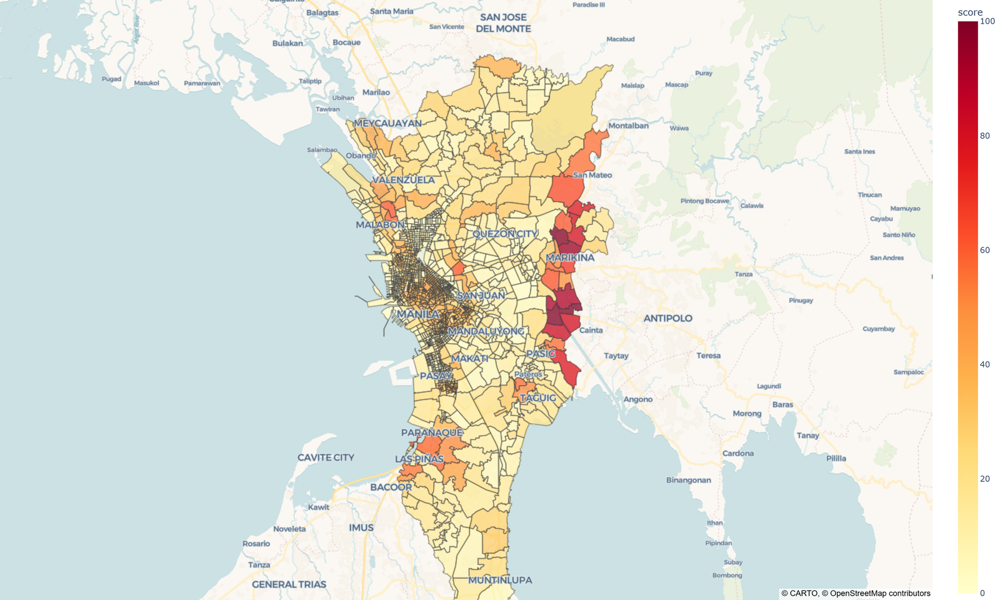
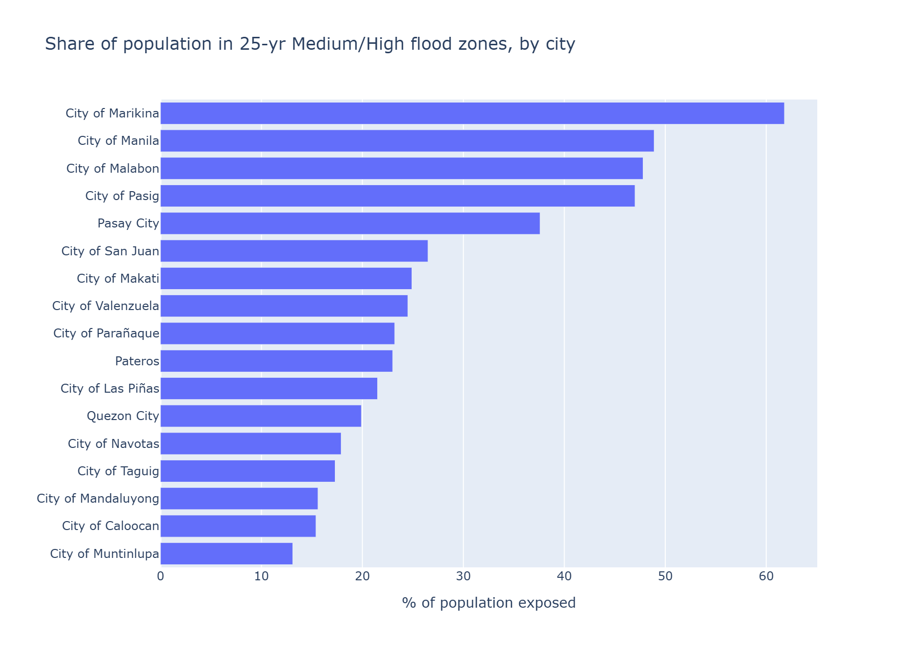
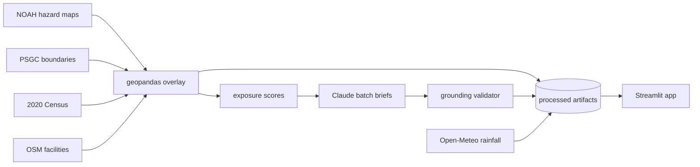

# 🌊 BahaMap — Metro Manila Flood Exposure Atlas

**Live app:** https://bahamap-ftq9fcw37j2maqlib3msmo.streamlit.app

Who in Metro Manila lives in harm's way when the floods come? BahaMap scores all
**1,710 NCR barangays** by flood exposure and explains each one in plain English
and Tagalog.



## Findings

1. **2,375,803 residents** live in 676 barangays where at least half the land sits in the 25-year Medium/High flood zone.
2. An estimated **3,733,329 of NCR's 13.5M residents (27.7%)** live inside 25-yr Medium/High zones.
3. **445 schools and 179 health facilities** (OSM-mapped) stand inside those zones.
4. Exposure is concentrated: the top 100 barangays (5.8% of the count) hold **46.5%** of all exposed residents.
5. Days of ≥50mm rain **did not significantly change** since 1940 (p=0.55); only days ≥100mm rose marginally (+0.07/decade, p=0.047).

Full memo: [docs/findings-memo.md](docs/findings-memo.md)



## How it works



Everything is precomputed offline by numbered pipeline scripts (`pipeline/01…07`);
the Streamlit app reads only the small committed artifacts in `data/processed/` —
no runtime geospatial computation, no runtime API calls. Pure functions live in
importable modules with a pytest suite; `notebooks/qa.py` is the acceptance gate
(it caught, among other things, that NOAH's 100-yr layer isn't strictly a
superset of the 25-yr layer — see `docs/data-notes.md` for that story and the
census pcode-vintage saga).

## The AI part, honestly

Briefs are generated per-barangay (claude-haiku-4-5, Batch API) from that
barangay's computed numbers with a "use only these numbers" contract, then
machine-validated: any number in the text that isn't in the input payload fails
the brief, which is replaced by a deterministic template. Grounding pass rate on
the current build: *pending first full generation run*.

## Run it yourself

```bash
python -m venv .venv
.venv/Scripts/python -m pip install -r requirements.txt   # Windows paths; use bin/ on unix
.venv/Scripts/python pipeline/01_download.py              # fetches all five raw sources
.venv/Scripts/python pipeline/02_normalize_hazards.py
.venv/Scripts/python pipeline/03_join_census.py
.venv/Scripts/python pipeline/04_overlay_exposure.py
.venv/Scripts/python pipeline/05_rainfall.py
.venv/Scripts/python notebooks/qa.py                      # acceptance checks
.venv/Scripts/python -m streamlit run app/Home.py
# optional, needs ANTHROPIC_API_KEY:
.venv/Scripts/python pipeline/06_generate_briefs.py --limit 5
.venv/Scripts/python pipeline/07_validate_briefs.py
```

Built with [Claude Code](https://claude.com/claude-code) driving an approved
spec and 17-task plan (`docs/superpowers/`), with tests written before
implementations and hard QA gates between pipeline stages.

## Data & credits

| Layer | Source | License/terms |
|---|---|---|
| Flood hazard maps (5/25/100-yr) | [UP Project NOAH](https://noah.up.edu.ph) / DOST-ASTI LiPAD; BetterGov HF mirror | © UP NOAH Center / DOST |
| Barangay boundaries | PSA PSGC via [altcoder/philippines-psgc-shapefiles](https://github.com/altcoder/philippines-psgc-shapefiles) | public data |
| Population (2020 census) | PSA via [OCHA/HDX](https://data.humdata.org) | CC-BY |
| Schools & health facilities | © [OpenStreetMap](https://www.openstreetmap.org) contributors | ODbL |
| Rainfall (ERA5, 1940–2025) | [Open-Meteo](https://open-meteo.com) archive | CC-BY-4.0 |

Code is MIT-licensed (see [LICENSE](LICENSE)). **Disclaimer:** educational
project, not official hazard guidance — consult
[UP NOAH](https://noah.up.edu.ph) and [PAGASA](https://bagong.pagasa.dost.gov.ph)
for real decisions.
